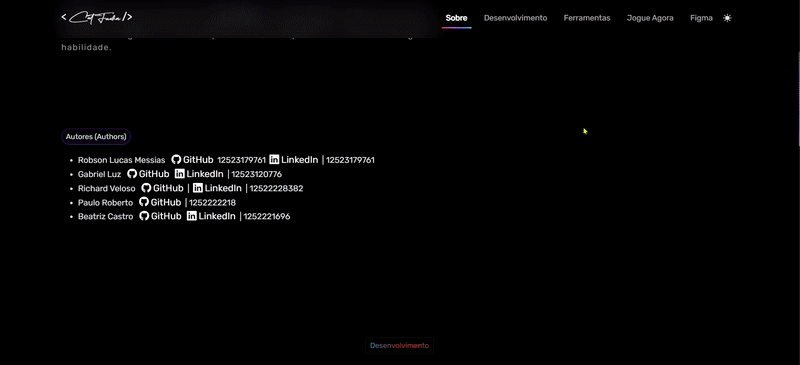

  
  
<h5 align="center"> 
  <b>✅ Completo</b> | <b>✅ Funcional </b> | <a href="https://test-game-azure.vercel.app">JOGUE AGORA🎮</a> | <a href="https://homepage-cat-fawn.vercel.app">SITE 🌐</a> 
</h5>
    

Cat Fawn é um jogo emocionante que combina aventura, desafios únicos e mecânicas interativas. Acompanhe o corajoso **Cat Fawn** em sua jornada épica em busca de glória enfrentando obstáculos e mares imprevisíveis.

  
## Demonstração
  
  

---

## 🚀 Visão Geral

- **Gameplay**: Uma experiência intuitiva e dinâmica que desafia as habilidades do jogador.
- **Desenvolvimento Modular**: Estrutura escalável e reutilizável, garantindo qualidade e desempenho.
- **Equipe Criativa**: Um time dedicado à criação de um jogo envolvente e divertido.

---

## 🕹️ Jogabilidade

### 📌 Objetivos Principais
- Criar interações envolventes e intuitivas para o jogador.
- Sistema de movimento fluido com mecânicas de física e transformações.
- Interatividade rica com elementos do ambiente, como coleta de itens e resolução de obstáculos.

### 🌟 Funcionalidades
- **Controle do Jogador**: Movimentação, saltos, corridas e interações.
- **Coleta e Pontuação**: Sistema de detecção de colisões para itens colecionáveis.
- **Balanceamento de Dificuldade**: Ajustes dinâmicos para criar desafios progressivos.

---

## 🛠️ Desenvolvimento

### 🗂️ Estrutura do Jogo
- **Gerenciamento de Estados**: Menu, gameplay ativo, pausa e fim de jogo utilizando o *State Machine Pattern*.
- **Gerenciamento de Recursos**: Carregamento dinâmico de cenas e otimização de memória.
- **Padrões de Projeto**:
  - Singleton: Para gerenciamento global (pontuação, configurações, etc.).
  - Observer: Para eventos como notificações em tempo real.

---

## 📋 Ferramentas e Tecnologias

- **Front-End**: 
  - HTML5, CSS3, Bootstrap.
  - Animações com AOS (Animate On Scroll).
- **Back-End**:
  - Implementações futuras para sistemas de salvamento e analytics.
- **Design**: Protótipos no Figma.
- **Versionamento**: Git e GitHub.

---

## 📬 Contato

Se gostou do projeto ou tem sugestões, entre em contato conosco:

- **Site**: [Entre em contato](https://lucasmessias.vercel.app/).
- **Jogue Agora**: [Cat Fawn - Jogue Agora](https://test-game-azure.vercel.app).

---

## 👩🏻‍💻 Autor  

<table>
  <tr>
    <td align="center">
      <a href="https://lucasmessias.vercel.app">
         
        
          <b>Robson Lucas Messias</b>
        
      </a>
    </td>
  </tr>
</table>

 
<h4 align="center">
  Made by: Robson Lucas Messias | <a href="mailto:robsonlmds@hotmail.com">Contato</a>
</h4>

  

<h1 align="center">

</h1>

